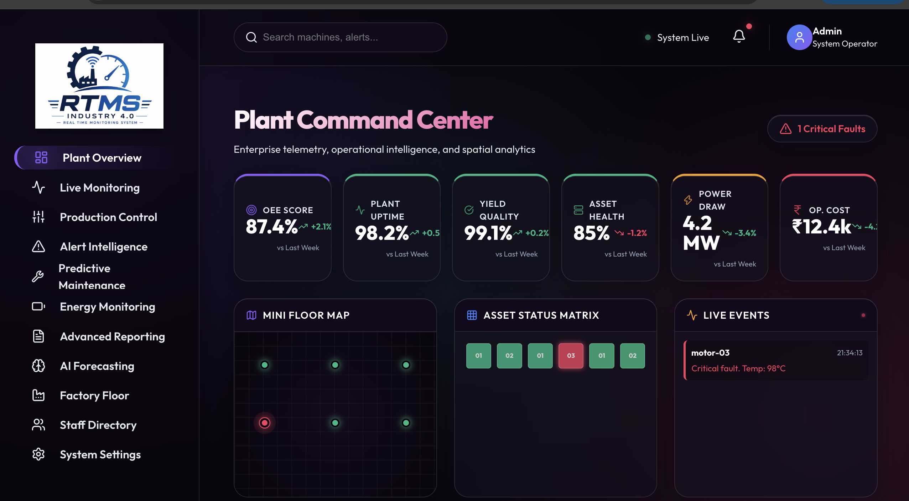
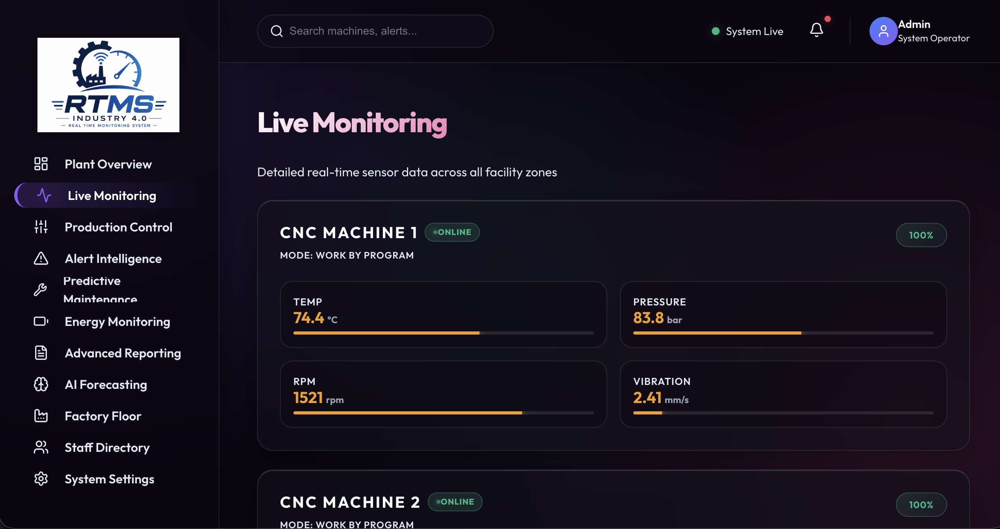
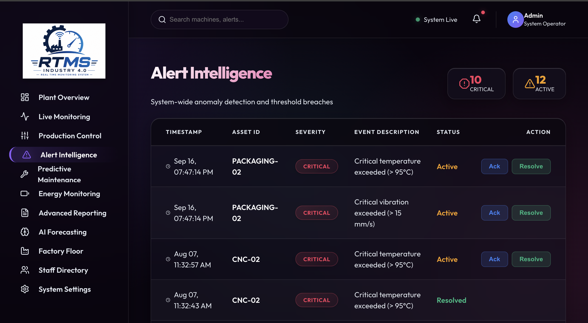
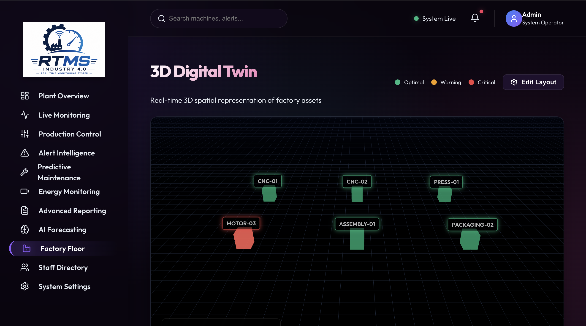
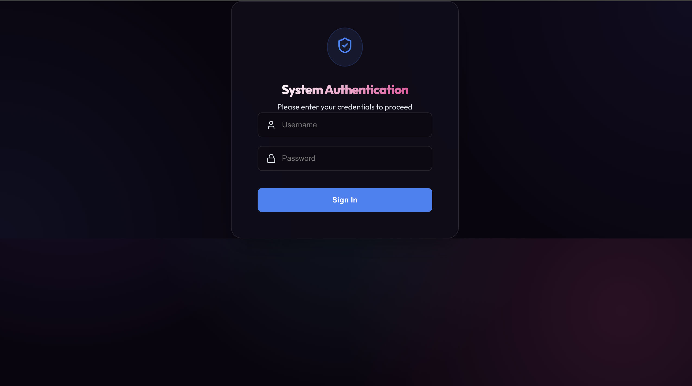

# Real-Time Machine Monitoring System (RTMS)


RTMS is a full-stack Industrial IoT (IIoT) dashboard for real-time telemetry, predictive maintenance, and 3D spatial mapping of factory floor assets.

## Table of Contents

- [Features](#features)
- [Screenshots](#screenshots)
- [Architecture](#architecture)
- [Tech Stack](#tech-stack)
- [Project Structure](#project-structure)
- [Getting Started](#getting-started)
- [Default Credentials](#default-credentials)
- [Future Improvements](#future-improvements)
- [Demo](#demo)
- [Author](#author)
- [License](#license)

## Features

| Capability | Description |
| :--- | :--- |
| Live Duplex Telemetry | Streams high-frequency machine data (temperature, vibration, pressure) from the backend via Socket.io |
| Predictive Forecasting | Simulated time-series models calculate Remaining Useful Life (RUL), anomaly probability, and component degradation |
| 3D Digital Twin | Interactive, high-performance 3D map of the factory floor built with React Three Fiber, with drag-and-drop layout management |
| Role-Based Access Control | JWT authentication with Admin, Operator, and Viewer roles |
| Glassmorphic UI | Custom design system with dynamic styling, live alerting, and real-time charts |

## Screenshots

| Dashboard | Live Monitoring |
| :---: | :---: |
|  |  |

| Alerts | 3D Factory View |
| :---: | :---: |
|  |  |

| Login |
| :---: |
|  |

## Architecture

```
React (Frontend)
      │
      │ REST + Socket.IO
      ▼
Express.js Backend
      │
      ├── SQLite Database
      ├── Authentication (JWT)
      └── Telemetry Simulation Engine
```

## Tech Stack

**Frontend**
- React 18 (Vite)
- React Three Fiber / Drei
- Recharts
- Lucide React
- Custom CSS design system

**Backend**
- Node.js / Express
- Socket.io
- SQLite3
- bcryptjs, jsonwebtoken

## Project Structure

```
RTMS/
├── backend/
│   ├── controllers/       # Route logic (auth, users, machines, etc.)
│   ├── database/          # SQLite configuration and seeding
│   ├── middleware/        # JWT auth verification
│   ├── routes/            # Express API endpoints
│   ├── simulationEngine/  # Socket.io telemetry generator
│   └── server.js          # Entry point
│
└── frontend/
    ├── src/
    │   ├── components/    # Reusable UI elements
    │   ├── context/       # AuthContext, SocketContext
    │   ├── pages/         # Dashboard, FloorMap, Settings, etc.
    │   ├── utils/         # Helper functions
    │   ├── App.jsx        # Routing (React Router)
    │   └── index.css      # Global design system
    └── package.json
```

## Getting Started

### Prerequisites

- [Node.js](https://nodejs.org/) (v18 or later recommended)

### Installation

Clone the repository and install dependencies for both services.

```bash
git clone <repository-url>
cd RTMS

# Backend
cd backend
npm install

# Frontend (in a new terminal)
cd frontend
npm install
```

### Running Locally

**Backend**

```bash
cd backend
node server.js
```

Runs on `http://localhost:5002`. On first run, the SQLite database is created and seeded automatically if empty.

**Frontend**

```bash
cd frontend
npm run dev
```

Runs on `http://localhost:5173`.

## Default Credentials

The database seed includes the following test accounts:

| Role | Username | Password | Access |
| :--- | :--- | :--- | :--- |
| Admin | `admin` | `admin123` | Full access — settings, staff directory, 3D layout editing |
| Operator | `operator` | `operator123` | Dashboard and monitoring |
| Viewer | `viewer` | `viewer123` | Read-only |

> Change or remove these credentials before deploying to production.

## Future Improvements

- Real Modbus TCP integration
- MongoDB support
- Predictive maintenance using AI
- Docker deployment
- Kubernetes support
- Grafana integration

## Demo

Coming soon.

## Author

**Ankit Verma**
B.Tech CSE (AI & ML), Maharaja Agrasen Institute of Technology
GitHub: [ankitverma023](https://github.com/ankitverma023)

## License

This project is licensed under the MIT License. See [LICENSE](./LICENSE) for details.